# neural-style-tf

This is a TensorFlow implementation of several techniques described in the papers: 
* [Image Style Transfer Using Convolutional Neural Networks](http://www.cv-foundation.org/openaccess/content_cvpr_2016/papers/Gatys_Image_Style_Transfer_CVPR_2016_paper.pdf)
by Leon A. Gatys, Alexander S. Ecker, Matthias Bethge
* [Artistic style transfer for videos](https://arxiv.org/abs/1604.08610)
by Manuel Ruder, Alexey Dosovitskiy, Thomas Brox
* [Preserving Color in Neural Artistic Style Transfer](https://arxiv.org/abs/1606.05897)
by Leon A. Gatys, Matthias Bethge, Aaron Hertzmann, Eli Shechtman  

Additionally, techniques are presented for semantic segmentation and multiple style transfer.

The Neural Style algorithm synthesizes a [pastiche](https://en.wikipedia.org/wiki/Pastiche) by separating and combining the content of one image with the style of another image using convolutional neural networks (CNN). Below is an example of transferring the artistic style of [The Starry Night](https://en.wikipedia.org/wiki/The_Starry_Night) onto a photograph of an African lion:

<p align="center">
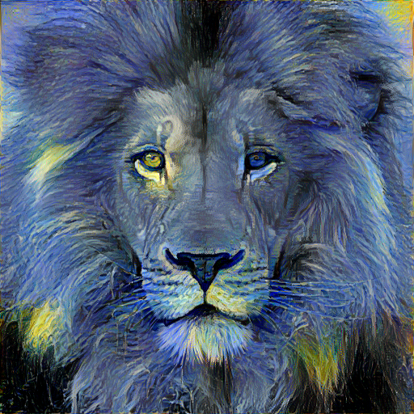
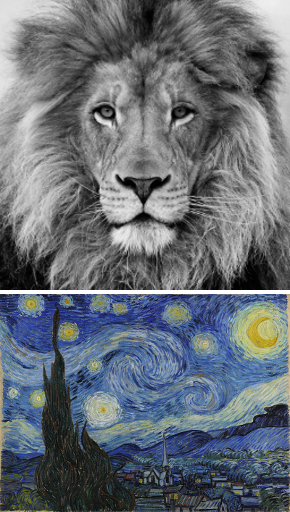
</p>

Transferring the style of various artworks to the same content image produces qualitatively convincing results:
<p align="center">
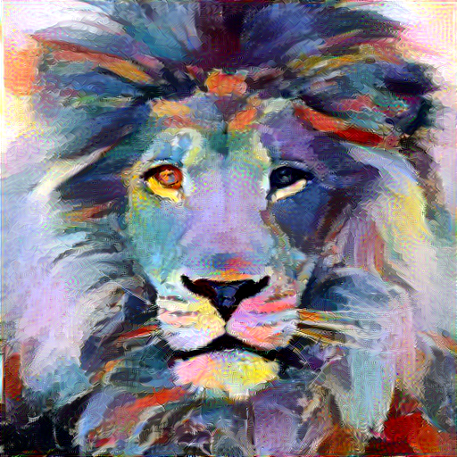
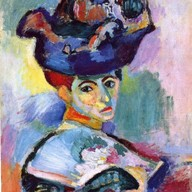
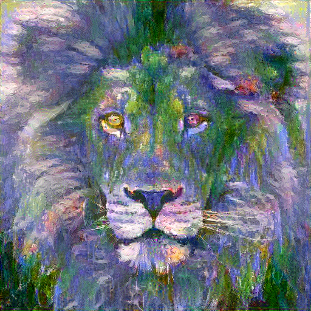
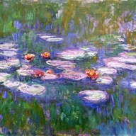

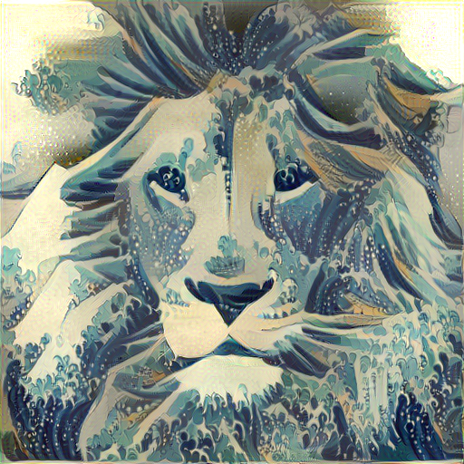

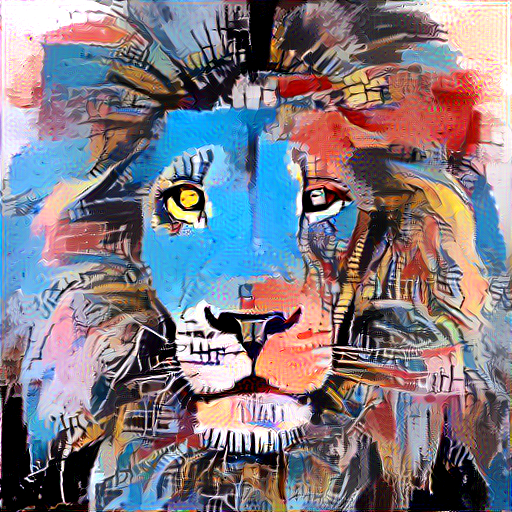
  

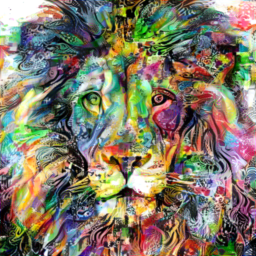
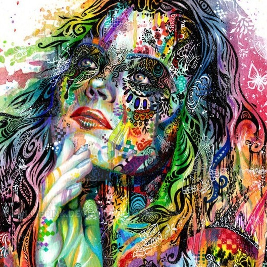

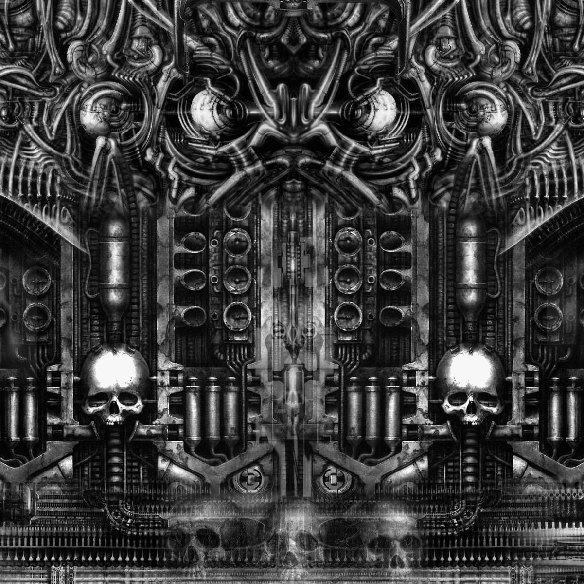
</p>

Here we reproduce Figure 3 from the first paper, which renders a photograph of the Neckarfront in Tübingen, Germany in the style of 5 different iconic paintings [The Shipwreck of the Minotaur](http://www.artble.com/artists/joseph_mallord_william_turner/paintings/the_shipwreck_of_the_minotaur), [The Starry Night](https://www.wikiart.org/en/vincent-van-gogh/the-starry-night-1889), [Composition VII](https://www.wikiart.org/en/wassily-kandinsky/composition-vii-1913), [The Scream](https://www.wikiart.org/en/edvard-munch/the-scream-1893), [Seated Nude](http://www.pablopicasso.org/seated-nude.jsp):
<p align="center">

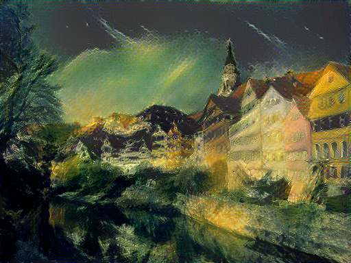
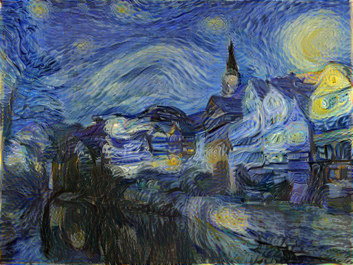

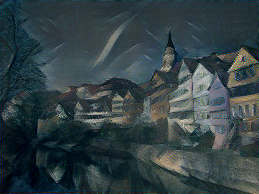
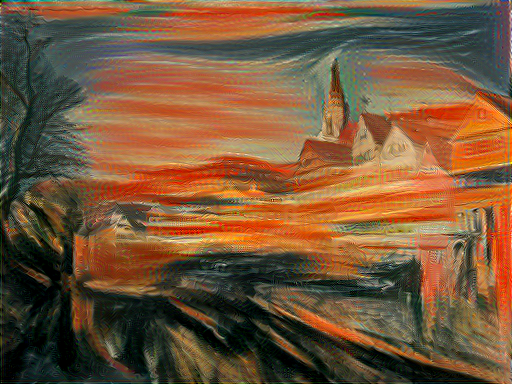
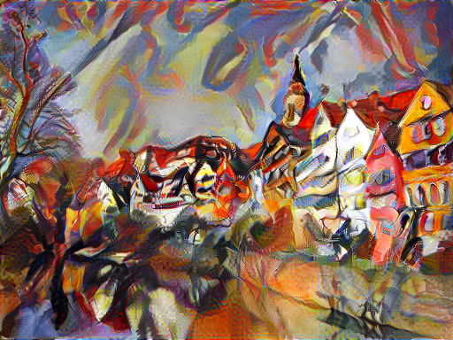
</p>

### Content / Style Tradeoff
The relative weight of the style and content can be controlled.

Here we render with an increasing style weight applied to [Red Canna](http://www.georgiaokeeffe.net/red-canna.jsp):
<p align="center">
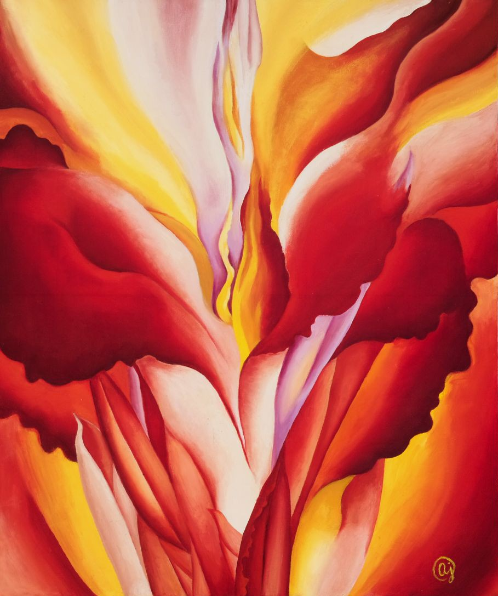
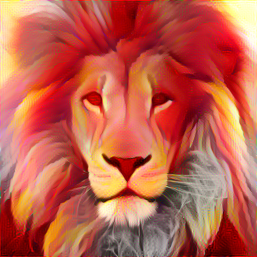
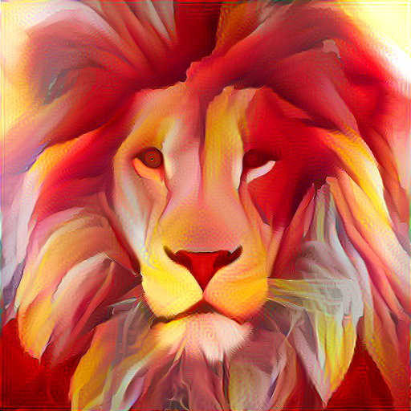
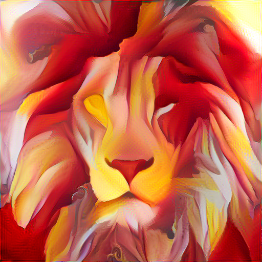
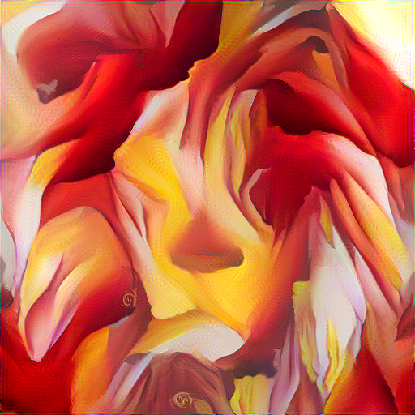
</p>

### Multiple Style Images
More than one style image can be used to blend multiple artistic styles.

<p align="center">
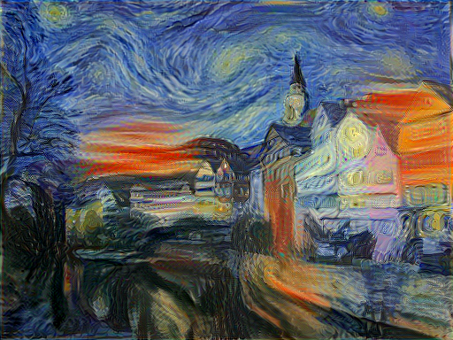
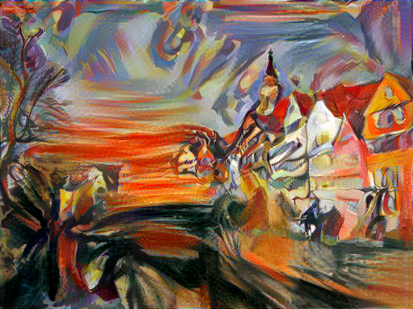
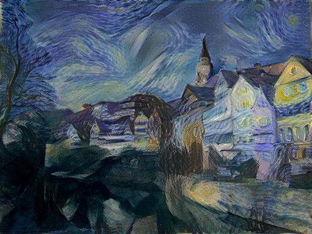  

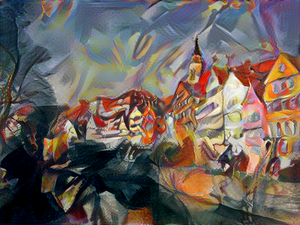
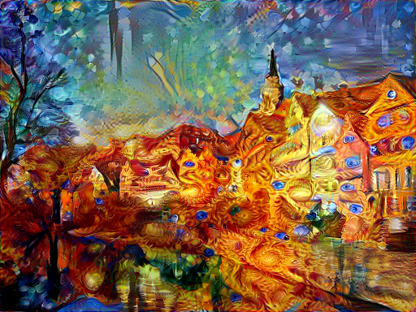
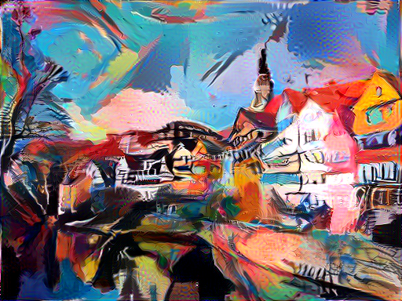
</p>

*Top row (left to right)*: [The Starry Night](https://www.wikiart.org/en/vincent-van-gogh/the-starry-night-1889) + [The Scream](https://www.wikiart.org/en/edvard-munch/the-scream-1893), [The Scream](https://www.wikiart.org/en/edvard-munch/the-scream-1893) + [Composition VII](https://www.wikiart.org/en/wassily-kandinsky/composition-vii-1913), [Seated Nude](http://www.pablopicasso.org/seated-nude.jsp) + [Composition VII](https://www.wikiart.org/en/wassily-kandinsky/composition-vii-1913)  
*Bottom row (left to right)*: [Seated Nude](http://www.pablopicasso.org/seated-nude.jsp) + [The Starry Night](https://www.wikiart.org/en/vincent-van-gogh/the-starry-night-1889), [Oversoul](http://alexgrey.com/art/paintings/soul/oversoul/) + [Freshness of Cold](https://afremov.com/FRESHNESS-OF-COLD-PALETTE-KNIFE-Oil-Painting-On-Canvas-By-Leonid-Afremov-Size-30-x40.html), [David Bowie](http://www.francoise-nielly.com/index.php/galerie/index/56) + [Skull](https://www.wikiart.org/en/jean-michel-basquiat/head) 

### Style Interpolation
When using multiple style images, the degree of blending between the images can be controlled.

<p align="center">
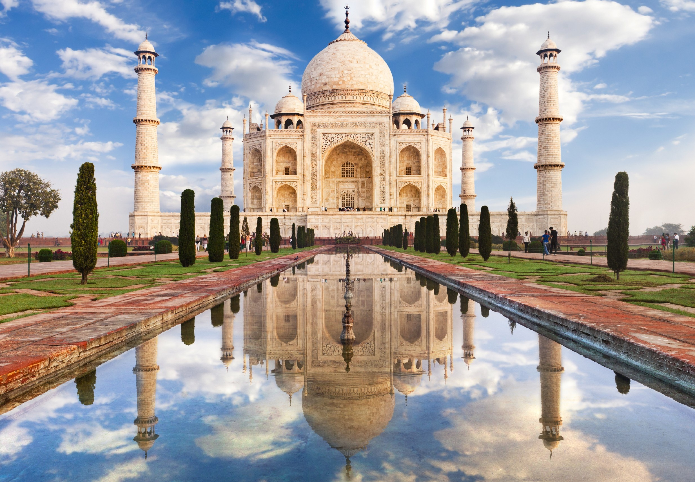
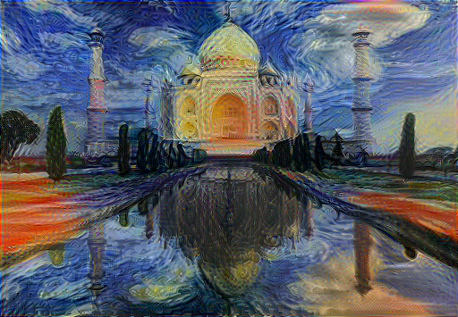
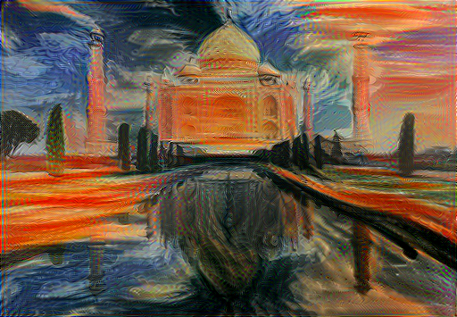


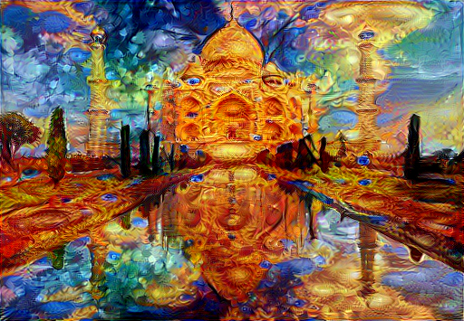

</p>

*Top row (left to right)*: content image, .2 [The Starry Night](https://www.wikiart.org/en/vincent-van-gogh/the-starry-night-1889) + .8 [The Scream](https://www.wikiart.org/en/edvard-munch/the-scream-1893), .8 [The Starry Night](https://www.wikiart.org/en/vincent-van-gogh/the-starry-night-1889) + .2 [The Scream](https://www.wikiart.org/en/edvard-munch/the-scream-1893)  
*Bottom row (left to right)*: .2 [Oversoul](http://alexgrey.com/art/paintings/soul/oversoul/) + .8 [Freshness of Cold](https://afremov.com/FRESHNESS-OF-COLD-PALETTE-KNIFE-Oil-Painting-On-Canvas-By-Leonid-Afremov-Size-30-x40.html), .5 [Oversoul](http://alexgrey.com/art/paintings/soul/oversoul/) + .5 [Freshness of Cold](https://afremov.com/FRESHNESS-OF-COLD-PALETTE-KNIFE-Oil-Painting-On-Canvas-By-Leonid-Afremov-Size-30-x40.html), .8 [Oversoul](http://alexgrey.com/art/paintings/soul/oversoul/) + .2 [Freshness of Cold](https://afremov.com/FRESHNESS-OF-COLD-PALETTE-KNIFE-Oil-Painting-On-Canvas-By-Leonid-Afremov-Size-30-x40.html)

### Transfer style but not color
The color scheme of the original image can be preserved by including the flag `--original_colors`. Colors are transferred using either the [YUV](https://en.wikipedia.org/wiki/YUV), [YCrCb](https://en.wikipedia.org/wiki/YCbCr), [CIE L\*a\*b\*](https://en.wikipedia.org/wiki/Lab_color_space), or [CIE L\*u\*v\*](https://en.wikipedia.org/wiki/CIELUV) color spaces.

Here we reproduce Figure 1 and Figure 2 in the third paper using luminance-only transfer:
<p align="center">
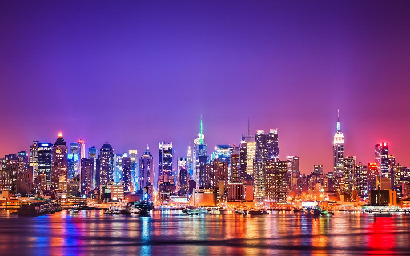
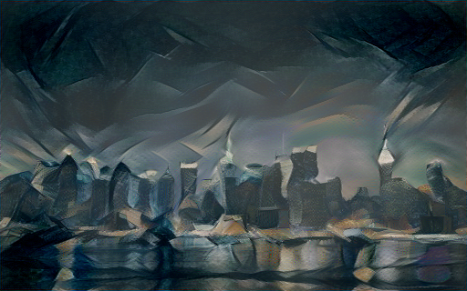
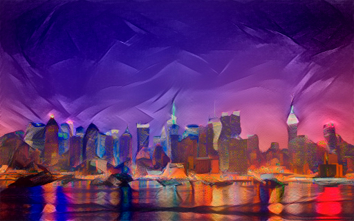

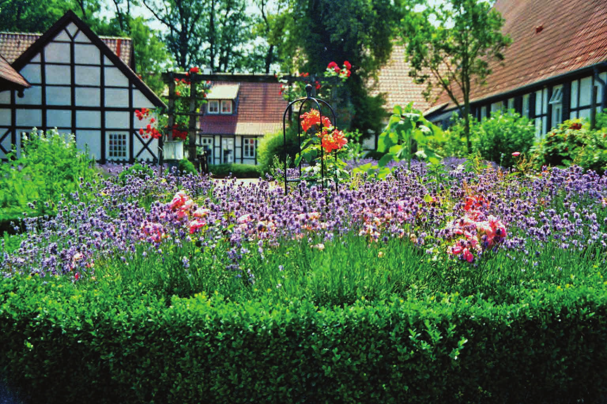
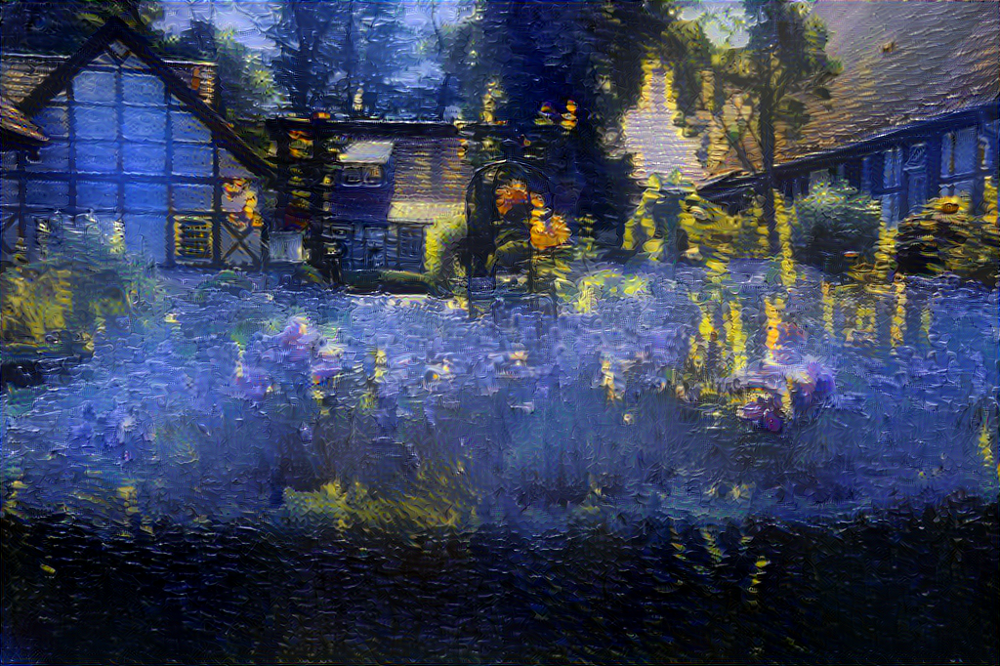
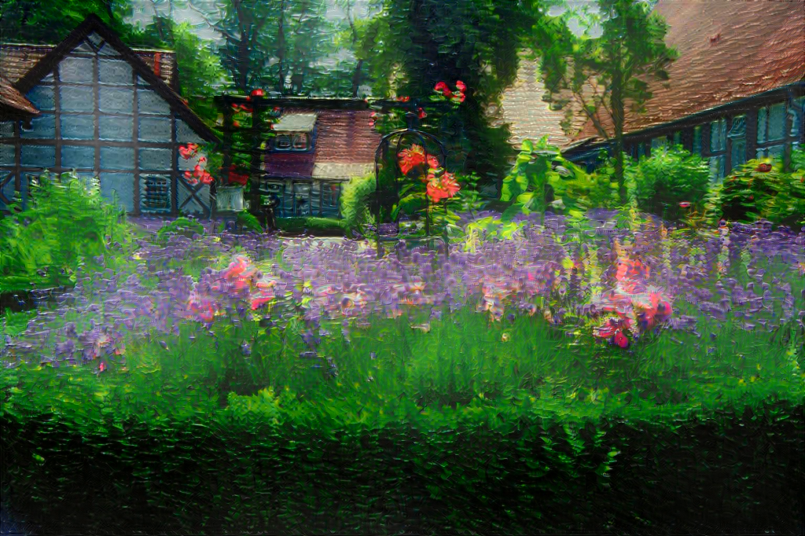
</p>

*Left to right*: content image, stylized image, stylized image with the original colors of the content image

### Textures
The algorithm is not constrained to artistic painting styles.  It can also be applied to photographic textures to create [pareidolic](https://en.wikipedia.org/wiki/Pareidolia) images.
<p align="center">
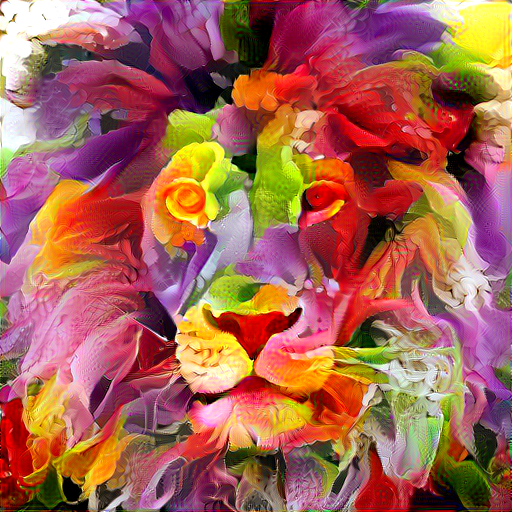

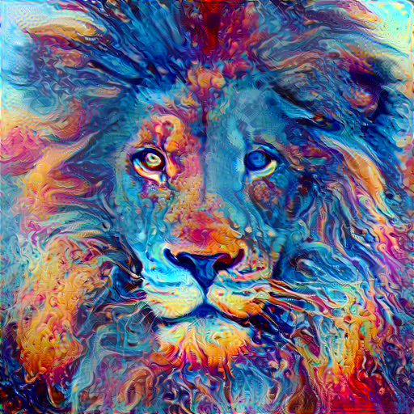
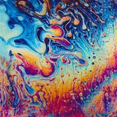

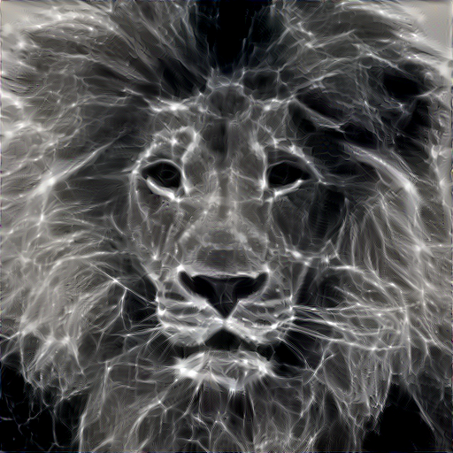
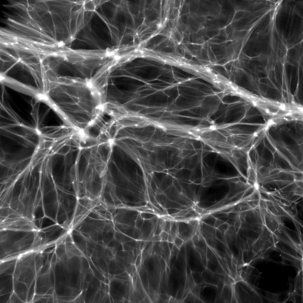
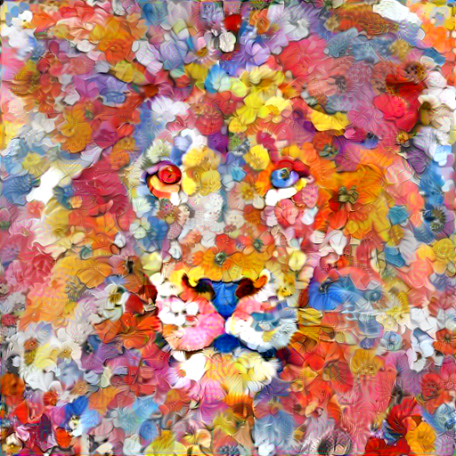
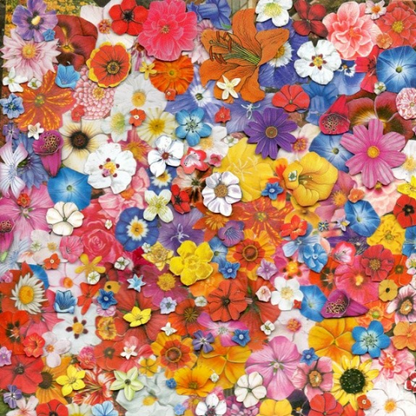
</p>

### Segmentation
Style can be transferred to semantic segmentations in the content image.
<p align="center">

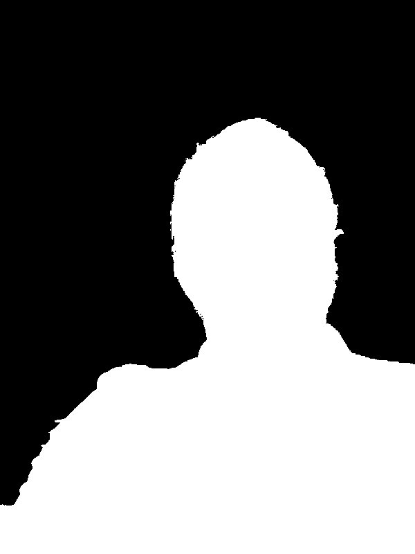
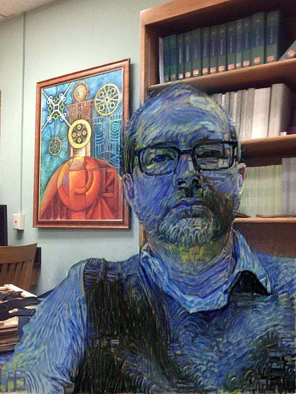  
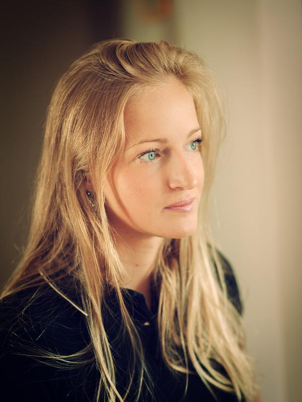
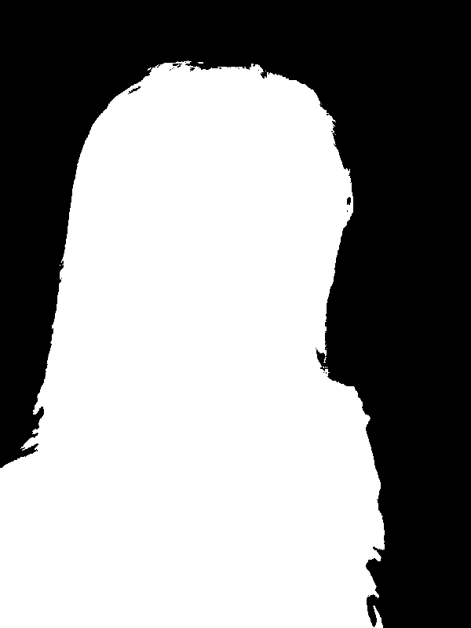
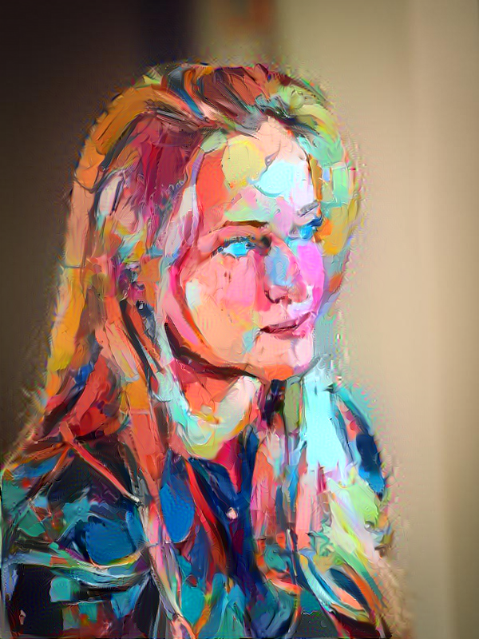  

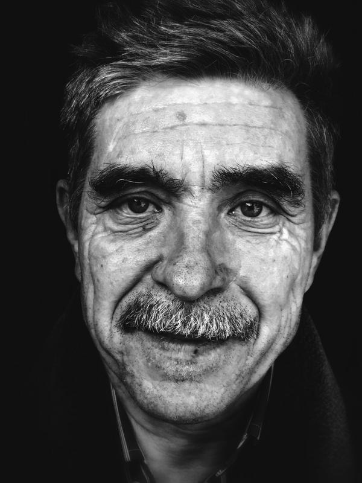


 
</p>

Multiple styles can be transferred to the foreground and background of the content image.
<p align="center">


</p>

*Left to right*: content image, foreground style, background style, foreground mask, background mask, stylized image

### Video
Animations can be rendered by applying the algorithm to each source frame.  For the best results, the gradient descent is initialized with the previously stylized frame warped to the current frame according to the optical flow between the pair of frames.  Loss functions for temporal consistency are used to penalize pixels excluding disoccluded regions and motion boundaries.

<p align="center">


<br>


</p>  

*Top row (left to right)*: source frames, ground-truth optical flow visualized      
*Bottom row (left to right)*: disoccluded regions and motion boundaries, stylized frames

Big thanks to Mike Burakoff	for finding a bug in the video rendering.

### Gradient Descent Initialization
The initialization of the gradient descent is controlled using `--init_img_type` for single images and `--init_frame_type` or `--first_frame_type` for video frames.  White noise allows an arbitrary number of distinct images to be generated.  Whereas, initializing with a fixed image always converges to the same output.

Here we reproduce Figure 6 from the first paper:
<p align="center">


</p>

*Top row (left to right)*: Initialized with the content image, the style image, white noise (RNG seed 1)  
*Bottom row (left to right)*: Initialized with white noise (RNG seeds 2, 3, 4)

### Layer Representations
The feature complexities and receptive field sizes increase down the CNN heirarchy.

Here we reproduce Figure 3 from [the original paper](https://arxiv.org/abs/1508.06576):
<table align='center'>
<tr align='center'>
<td></td>
<td>1 x 10^-5</td>
<td>1 x 10^-4</td>
<td>1 x 10^-3</td>
<td>1 x 10^-2</td>
</tr>
<tr>
<td>conv1_1</td>
<td></td>
<td></td>
<td></td>
<td></td>
</tr>
<tr>
<td>conv2_1</td>
<td></td>
<td></td>
<td></td>
<td></td>
</tr>
<tr>
<td>conv3_1</td>
<td></td>
<td></td>
<td></td>
<td></td>
</tr>
<tr>
<td>conv4_1</td>
<td></td>
<td></td>
<td></td>
<td></td>
</tr>
<tr>
<td>conv5_1</td>
<td></td>
<td></td>
<td></td>
<td></td>
</tr>
</table>

*Rows*: increasing subsets of CNN layers; i.e. 'conv4_1' means using 'conv1_1', 'conv2_1', 'conv3_1', 'conv4_1'.   
*Columns*: alpha/beta ratio of the the content and style reconstruction (see Content / Style Tradeoff).

## Setup
#### Dependencies:
* [tensorflow](https://github.com/tensorflow/tensorflow)
* [opencv](http://opencv.org/downloads.html)

#### Optional (but recommended) dependencies:
* [CUDA](https://developer.nvidia.com/cuda-downloads) 7.5+
* [cuDNN](https://developer.nvidia.com/cudnn) 5.0+

#### After installing the dependencies: 
* Download the [VGG-19 model weights](http://www.vlfeat.org/matconvnet/pretrained/) (see the "VGG-VD models from the *Very Deep Convolutional Networks for Large-Scale Visual Recognition* project" section). More info about the VGG-19 network can be found [here](http://www.robots.ox.ac.uk/~vgg/research/very_deep/).
* After downloading, copy the weights file `imagenet-vgg-verydeep-19.mat` to the project directory.

## Usage
### Basic Usage

#### Single Image
1. Copy 1 content image to the default image content directory `./image_input`
2. Copy 1 or more style images to the default style directory `./styles`
3. Run the command:
```
bash stylize_image.sh <path_to_content_image> <path_to_style_image>
```
*Example*:
```
bash stylize_image.sh ./image_input/lion.jpg ./styles/kandinsky.jpg
```
*Note*: Supported image formats include: `.png`, `.jpg`, `.ppm`, `.pgm`

*Note*: Paths to images should not contain the `~` character to represent your home directory; you should instead use a relative path or the absolute path.

#### Video Frames
1. Copy 1 content video to the default video content directory `./video_input`
2. Copy 1 or more style images to the default style directory `./styles`
3. Run the command:
```
bash stylize_video.sh <path_to_video> <path_to_style_image>
```
*Example*:
```
bash stylize_video.sh ./video_input/video.mp4 ./styles/kandinsky.jpg
```

*Note*: Supported video formats include: `.mp4`, `.mov`, `.mkv`

### Advanced Usage
#### Single Image or Video Frames
1. Copy content images to the default image content directory `./image_input` or copy video frames to the default video content directory `./video_input`  
2. Copy 1 or more style images to the default style directory `./styles`  
3. Run the command with specific arguments:
```
python neural_style.py <arguments>
```
*Example (Single Image)*:
```
python neural_style.py --content_img golden_gate.jpg \
                       --style_imgs starry-night.jpg \
                       --max_size 1000 \
                       --max_iterations 100 \
                       --original_colors \
                       --device /cpu:0 \
                       --verbose;
```

To use multiple style images, pass a *space-separated* list of the image names and image weights like this:

`--style_imgs starry_night.jpg the_scream.jpg --style_imgs_weights 0.5 0.5`

*Example (Video Frames)*:
```
python neural_style.py --video \
                       --video_input_dir ./video_input/my_video_frames \
                       --style_imgs starry-night.jpg \
                       --content_weight 5 \
                       --style_weight 1000 \
                       --temporal_weight 1000 \
                       --start_frame 1 \
                       --end_frame 50 \
                       --max_size 1024 \
                       --first_frame_iterations 3000 \
                       --verbose;
```
*Note*:  When using `--init_frame_type prev_warp` you must have previously computed the backward and forward optical flow between the frames.  See `./video_input/make-opt-flow.sh` and `./video_input/run-deepflow.sh`

#### Arguments
* `--content_img`: Filename of the content image. *Example*: `lion.jpg`
* `--content_img_dir`: Relative or absolute directory path to the content image. *Default*: `./image_input`
* `--style_imgs`: Filenames of the style images. To use multiple style images, pass a *space-separated* list.  *Example*: `--style_imgs starry-night.jpg`
* `--style_imgs_weights`: The blending weights for each style image.  *Default*: `1.0` (assumes only 1 style image)
* `--style_imgs_dir`: Relative or absolute directory path to the style images. *Default*: `./styles`
* `--init_img_type`: Image used to initialize the network. *Choices*: `content`, `random`, `style`. *Default*: `content`
* `--max_size`: Maximum width or height of the input images. *Default*: `512`
* `--content_weight`: Weight for the content loss function. *Default*: `5e0`
* `--style_weight`: Weight for the style loss function. *Default*: `1e4`
* `--tv_weight`: Weight for the total variational loss function. *Default*: `1e-3`
* `--temporal_weight`: Weight for the temporal loss function. *Default*: `2e2`
* `--content_layers`: *Space-separated* VGG-19 layer names used for the content image. *Default*: `conv4_2`
* `--style_layers`: *Space-separated* VGG-19 layer names used for the style image. *Default*: `relu1_1 relu2_1 relu3_1 relu4_1 relu5_1`
* `--content_layer_weights`: *Space-separated* weights of each content layer to the content loss. *Default*: `1.0`
* `--style_layer_weights`: *Space-separated* weights of each style layer to loss. *Default*: `0.2 0.2 0.2 0.2 0.2`
* `--original_colors`: Boolean flag indicating if the style is transferred but not the colors.
* `--color_convert_type`: Color spaces (YUV, YCrCb, CIE L\*u\*v\*, CIE L\*a\*b\*) for luminance-matching conversion to original colors. *Choices*: `yuv`, `ycrcb`, `luv`, `lab`. *Default*: `yuv`
* `--style_mask`: Boolean flag indicating if style is transferred to masked regions.
* `--style_mask_imgs`: Filenames of the style mask images (example: `face_mask.png`). To use multiple style mask images, pass a *space-separated* list.  *Example*: `--style_mask_imgs face_mask.png face_mask_inv.png`
* `--noise_ratio`: Interpolation value between the content image and noise image if network is initialized with `random`. *Default*: `1.0`
* `--seed`: Seed for the random number generator. *Default*: `0`
* `--model_weights`: Weights and biases of the VGG-19 network.  Download [here](http://www.vlfeat.org/matconvnet/pretrained/). *Default*:`imagenet-vgg-verydeep-19.mat`
* `--pooling_type`: Type of pooling in convolutional neural network. *Choices*: `avg`, `max`. *Default*: `avg`
* `--device`: GPU or CPU device.  GPU mode highly recommended but requires NVIDIA CUDA. *Choices*: `/gpu:0` `/cpu:0`. *Default*: `/gpu:0`
* `--img_output_dir`: Directory to write output to.  *Default*: `./image_output`
* `--img_name`: Filename of the output image. *Default*: `result`
* `--verbose`: Boolean flag indicating if statements should be printed to the console.

#### Optimization Arguments
* `--optimizer`: Loss minimization optimizer.  L-BFGS gives better results.  Adam uses less memory. *Choices*: `lbfgs`, `adam`. *Default*: `lbfgs`
* `--learning_rate`: Learning-rate parameter for the Adam optimizer. *Default*: `1e0`  

<p align="center">

</p>

* `--max_iterations`: Max number of iterations for the Adam or L-BFGS optimizer. *Default*: `1000`
* `--print_iterations`: Number of iterations between optimizer print statements. *Default*: `50`
* `--content_loss_function`: Different constants K in the content loss function. *Choices*: `1`, `2`, `3`. *Default*: `1` 

<p align="center">

</p>

#### Video Frame Arguments
* `--video`: Boolean flag indicating if the user is creating a video.
* `--start_frame`: First frame number. *Default*: `1`
* `--end_frame`: Last frame number. *Default*: `1` 
* `--first_frame_type`: Image used to initialize the network during the rendering of the first frame. *Choices*: `content`, `random`, `style`. *Default*: `random`
* `--init_frame_type`: Image used to initialize the network during the every rendering after the first frame. *Choices*: `prev_warped`, `prev`, `content`, `random`, `style`. *Default*: `prev_warped`
* `--video_input_dir`: Relative or absolute directory path to input frames. *Default*: `./video_input`
* `--video_output_dir`: Relative or absolute directory path to write output frames to. *Default*: `./video_output`
* `--content_frame_frmt`: Format string of input frames. *Default*: `frame_{}.png`
* `--backward_optical_flow_frmt`: Format string of backward optical flow files. *Default*: `backward_{}_{}.flo`
* `--forward_optical_flow_frmt`: Format string of forward optical flow files. *Default*: `forward_{}_{}.flo`
* `--content_weights_frmt`: Format string of optical flow consistency files. *Default*: `reliable_{}_{}.txt`
* `--prev_frame_indices`: Previous frames to consider for longterm temporal consistency. *Default*: `1`
* `--first_frame_iterations`: Maximum number of optimizer iterations of the first frame. *Default*: `2000`
* `--frame_iterations`: Maximum number of optimizer iterations for each frame after the first frame. *Default*: `800`

## Questions and Errata

Send questions or issues:  


## Memory
By default, `neural-style-tf` uses the NVIDIA cuDNN GPU backend for convolutions and L-BFGS for optimization.
These produce better and faster results, but can consume a lot of memory. You can reduce memory usage with the following:

* **Use Adam**: Add the flag `--optimizer adam` to use Adam instead of L-BFGS. This should significantly
  reduce memory usage, but will require tuning of other parameters for good results; in particular you should
  experiment with different values of `--learning_rate`, `--content_weight`, `--style_weight`
* **Reduce image size**: You can reduce the size of the generated image with the `--max_size` argument.

## Implementation Details
All images were rendered on a machine with:
* **CPU:** Intel Core i7-6800K @ 3.40GHz × 12 
* **GPU:** NVIDIA GeForce GTX 1080/PCIe/SSE2
* **OS:** Linux Ubuntu 16.04.1 LTS 64-bit
* **CUDA:** 8.0
* **python:** 2.7.12
* **tensorflow:** 0.10.0rc
* **opencv:** 2.4.9.1

## Acknowledgements

The implementation is based on the projects: 
* Torch (Lua) implementation 'neural-style' by [jcjohnson](https://github.com/jcjohnson)
* Torch (Lua) implementation 'artistic-videos' by [manuelruder](https://github.com/manuelruder)

Source video frames were obtained from:
* [MPI Sintel Flow Dataset](http://sintel.is.tue.mpg.de/)

Artistic images were created by the modern artists:
* [Alex Grey](http://alexgrey.com/)
* [Minjae Lee](http://www.grenomj.com/)
* [Leonid Afremov](https://afremov.com/)
* [Françoise Nielly](http://www.francoise-nielly.com/)
* [James Jean](http://www.jamesjean.com/)
* [Ben Giles](https://benlewisgiles.format.com/)
* [Callie Fink](http://calliefink.deviantart.com/)
* [H.R. Giger](https://en.wikipedia.org/wiki/H._R._Giger)
* [Voka](http://www.voka.at/)

Artistic images were created by the popular historical artists:
* [Vincent Van Gogh](https://www.wikiart.org/en/vincent-van-gogh)
* [Wassily Kandinsky](https://www.wikiart.org/en/wassily-kandinsky)
* [Georgia O'Keeffe](http://www.georgiaokeeffe.net/)
* [Jean-Michel Basquiat](http://basquiat.com/)
* [Édouard Manet](http://www.manet.org/)
* [Pablo Picasso](https://www.wikiart.org/en/pablo-picasso)
* [Joseph Mallord William Turner](https://en.wikipedia.org/wiki/J._M._W._Turner)
* [Frida Kahlo](https://en.wikipedia.org/wiki/Frida_Kahlo)

Bash shell scripts for testing were created by my brother [Sheldon Smith](http://www.imdb.com/name/nm4328496/).

## Citation

If you find this code useful for your research, please cite:

```
@misc{Smith2016,
  author = {Smith, Cameron},
  title = {neural-style-tf},
  year = {2016},
  publisher = {GitHub},
  journal = {GitHub repository},
  howpublished = {\url{https://github.com/cysmith/neural-style-tf}},
}
```
